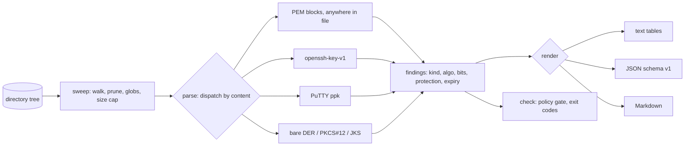

# keysweep

[English](README.md) | [中文](README.zh.md) | [日本語](README.ja.md)

[](LICENSE) [](go.mod) [](CHANGELOG.md)  [](CONTRIBUTING.md)

**keysweep：ディスク上のすべての秘密鍵と証明書を棚卸しする、オープンソースかつ依存ゼロの CLI。種別・ビット数・保護状態・有効期限を報告し、「このマシンに無防備な秘密鍵は何本あるのか？」をコマンド一発で答えられる問いに変える。**


```bash
git clone https://github.com/JaydenCJ/keysweep && cd keysweep
go build -o keysweep ./cmd/keysweep    # single static binary, stdlib only
```

> プレリリース：v0.1.0 はまだどのパッケージレジストリにも公開されていません。上記の手順でソースからビルドしてください（Go ≥1.22 なら可）。

## なぜ keysweep？

開発マシンには暗号マテリアルが静かに溜まっていく。三社前の SSH 鍵、wiki からコピーした TLS 秘密鍵、署名式で受け取った `.p12`、「一時的に」`.env` へ貼り付けた Ed25519 鍵。そのうち何本が**パスフレーズなし**で、誰でも読める権限で、あるいは去年期限切れした証明書とともに転がっているか、誰も知らない。シークレットスキャナーはこの問いに答えない——gitleaks や trufflehog が探すのは git 履歴中の API キー*文字列*であって、鍵*ファイル*とその保護状態ではない。手作業ルート（`find` + ファイルごとの `openssl pkcs8/x509/rsa`）は全エンコーディングを事前に知っている必要があるうえ、開発者が日常的に使うフォーマットを読めない：`openssl` は OpenSSH 鍵にパスフレーズが掛かっているか教えてくれず、PuTTY `.ppk` のヘッダを読むには PuTTY 自身のツールを持ち出すしかない。keysweep は内容でマテリアルを識別する——あらゆるファイルの任意の位置にある PEM、OpenSSH、PPK、生 DER、PKCS#12、JKS——そして各項目について重要な四つの事実を報告する：それは何か、どれだけ強いか、パスフレーズで守られているか、いつ失効するか。`check` サブコマンドは同じスキャンを、リリーススクリプトや pre-push フック向けの終了コードゲートに変える。すべてオフラインで動き、何も復号せず、1 バイトもどこにも送らない。

| | keysweep | gitleaks / trufflehog | `find` + openssl | 証明書期限モニター |
|---|---|---|---|---|
| API キー文字列ではなく鍵/証明書**ファイル**が対象 | ✅ | ❌ git 内の文字列 | ✅ | ❌ エンドポイントのみ |
| パスフレーズ保護状態を報告 | ✅ 暗号方式つき | ❌ | 部分的、形式ごとに手動 | ❌ |
| OpenSSH と PuTTY 形式を読める | ✅ | ❌ | ❌ | ❌ |
| 設定ファイルに埋め込まれた鍵を発見 | ✅ 行番号つき | ✅ | ❌ | ❌ |
| 証明書の期限 + 自己署名 + CA フラグ | ✅ | ❌ | ファイルごとに手作業 | ✅ SaaS、要ネット |
| ファイル権限の監査（0644 の鍵はフラグ） | ✅ | ❌ | ❌ | ❌ |
| 終了コードつきポリシーゲート | ✅ | ✅ | ❌ | ❌ |
| オフライン、ランタイム依存ゼロ | ✅ Go 標準ライブラリのみ | ❌ 依存あり | ✅ | ❌ SaaS |

<sub>依存数は 2026-07-12 確認：keysweep は Go 標準ライブラリのみを import。gitleaks v8 は約 40 個、trufflehog v3 は約 200 個の Go module を取得する。</sub>

## 機能

- **内容ベースの検出** — あらゆるファイルの任意の位置で PEM ブロックを発見（`.env` に貼られた鍵は `deploy/.env:5` として報告）。さらに OpenSSH、PuTTY `.ppk`、生 DER、PKCS#12、JKS/JCEKS をマジックナンバーと厳密なパースで識別。拡張子は一切信用しない。
- **復号せずに保護状態を判定** — OpenSSH ヘッダ、`DEK-Info` 行、PBES2 OID から暗号方式を読み取り、暗号化済みの鍵は `encrypted aes-256-cbc (pbkdf2)`、裸の鍵は `plaintext` と報告。keysweep がパスフレーズを求める・受け取ることは決してない。
- **暗号化された鍵でもビット数を報告** — OpenSSH と PPK 形式は公開鍵ブロブを平文で格納している。keysweep は SSH ワイヤ形式をパースし、開けない（開かない）鍵にも `rsa 3072` と報告する。
- **証明書インテリジェンス** — サブジェクト、発行者、残日数つき有効期限、自己署名と CA フラグ。PEM チェーンも生 DER も同等に扱う。
- **権限監査** — 所有者以外が読める秘密鍵はすべてフラグ。判定は OpenSSH が identity ファイルを拒否する `0o077` チェックと同一。
- **自動化向けポリシーゲート** — `keysweep check` は平文鍵、緩い権限、期限切れ・期限間近の証明書、下限未満の RSA ビット数で終了コード 1 を返す。各ルールはフラグで調整・無効化できる。
- **依存ゼロ、完全オフライン** — Go 標準ライブラリのみ。テレメトリなし、ネットワークアクセスは一切なし。レポートは決定的：同じツリーなら同じバイト列。

## クイックスタート

```bash
# assemble a demo tree from the repo's committed throwaway fixtures
bash examples/make-demo-dir.sh /tmp/keysweep-demo
./keysweep scan /tmp/keysweep-demo
```

実際にキャプチャした出力：

```text
keysweep scan — /tmp/keysweep-demo
files scanned: 13 · findings: 13

PRIVATE KEYS (7)
  PATH                  ALGO    BITS FORMAT    PROTECTION                     PERMS
  deploy/.env:5         ed25519 256  pkcs8-pem plaintext                      0600
  legacy/ancient.key    dsa     1024 dsa-pem   plaintext                      0644 !
  legacy/server-enc.key ?       -    pkcs8-pem encrypted aes-256-cbc (pbkdf2) 0600
  legacy/server.key     rsa     2048 pkcs1-pem plaintext                      0644 !
  ssh/id_ed25519        ed25519 256  openssh   plaintext                      0600
  ssh/id_rsa            rsa     3072 openssh   encrypted aes256-ctr           0600
  ssh/putty.ppk         rsa     3072 ppk2      encrypted aes256-cbc           0600

CERTIFICATES (3)
  PATH                 SUBJECT              ALGO        BITS NOT AFTER  STATUS
  pki/fullchain.pem    server.example.test  rsa         2048 2036-01-01 ok (3458d)
  pki/fullchain.pem:16 Example Test Root CA ecdsa P-256 256  2036-01-01 ok (3458d)
  pki/old.crt          old.example.test     ed25519     256  2025-01-01 EXPIRED 558d ago

CERTIFICATE REQUESTS (1)
  PATH        SUBJECT          ALGO        BITS
  pki/req.csr req.example.test ecdsa P-256 256

CONTAINERS (2)
  PATH               FORMAT PROTECTION
  store/bundle.p12   pkcs12 password
  store/keystore.jks jks    password

SUMMARY
  private keys : 7 (4 plaintext, 3 encrypted; 2 with loose permissions)
  certificates : 3 (1 expired)
  csr          : 1
  containers   : 2
```

リリースの門番にする（`keysweep check --min-rsa-bits 3072`、実出力、終了コード 1）：

```text
BREACH plaintext-key      deploy/.env:5 — private key stored without a passphrase
BREACH plaintext-key      legacy/ancient.key — private key stored without a passphrase
BREACH loose-permissions  legacy/ancient.key — private key readable beyond owner (mode 0644)
BREACH plaintext-key      legacy/server.key — private key stored without a passphrase
BREACH loose-permissions  legacy/server.key — private key readable beyond owner (mode 0644)
BREACH weak-rsa           legacy/server.key — rsa key is 2048 bits, below the 3072-bit floor
BREACH expired            pki/old.crt — certificate "old.example.test" expired 558d ago
BREACH plaintext-key      ssh/id_ed25519 — private key stored without a passphrase
check: 13 files scanned, 13 findings, 8 breaches — FAIL
```

両サブコマンドとも `--format json` で安定した機械可読エンベロープ（`schema_version: 1`）を出力する。

## 検出対象

検出は内容ベースかつ厳密——完全なルールは [docs/formats.md](docs/formats.md) を参照。

| マテリアル | 形式 | シークレットなしで得られる情報 |
|---|---|---|
| 秘密鍵 | PKCS#1、PKCS#8（平文 + 暗号化）、SEC1、DSA、OpenSSH、PPK v1–3、生 DER | アルゴリズム、曲線、ビット数、暗号方式、KDF |
| 証明書 | X.509 PEM（チェーン含む）と DER | サブジェクト、発行者、有効期間、鍵アルゴリズム/ビット数、自己署名、CA |
| CSR | PKCS#10 PEM | サブジェクト、鍵アルゴリズム/ビット数 |
| コンテナ | PKCS#12/PFX、JKS、JCEKS | 形式 + パスワード包装の状態 |

## CLI リファレンス

`keysweep [scan|check|version] [flags] [path]` — 既定サブコマンドは `scan`。終了コード：0 正常、1 check 違反、2 用法エラー、3 実行時エラー。

| フラグ | 既定値 | 効果 |
|---|---|---|
| `--format` | `text` | `text`、`json`、`markdown` のいずれか（`check`：`text`/`json`） |
| `--exclude` | — | glob に一致するパスを除外、例 `'vendor/**'`（複数回可） |
| `--max-file-size` | `1048576` | N バイト超のファイルを除外 |
| `--all` | オフ | `.git` や `node_modules` など既定除外ディレクトリも走査 |
| `--jobs` | CPU 数 | 並列パーサーのワーカー数 |
| `--expiring` | `30`（scan）/ `0`（check） | N 日以内に失効する証明書をフラグ/違反にする |
| `--allow-plaintext`（check） | オフ | 非暗号化の秘密鍵を違反にしない |
| `--ignore-perms`（check） | オフ | グループ/全員可読の鍵ファイルを違反にしない |
| `--min-rsa-bits`（check） | `0`（オフ） | N ビット未満の RSA 鍵を違反にする |

## 検証

このリポジトリは CI を同梱しない。上記のすべての主張はローカル実行で検証される：

```bash
go test ./...            # 92 deterministic tests, offline, < 5 s
bash scripts/smoke.sh    # end-to-end CLI check, prints SMOKE OK
```

## アーキテクチャ



## ロードマップ

- [x] v0.1.0 — 内容ベースの PEM/OpenSSH/PPK/DER/PKCS#12/JKS 検出、保護状態と暗号方式の報告、証明書期限、権限監査、text/JSON/Markdown レポート、`check` ポリシーゲート、92 テスト + smoke スクリプト
- [ ] 公開鍵 ↔ 秘密鍵のペアリング（片割れだけ残った鍵ペアの発見）
- [ ] `--baseline` スナップショットで棚卸し結果を時系列比較（「今月何が増えた？」）
- [ ] RSA 以外の弱パラメータ警告（1024 ビット DSA、P-192、`des-cbc` 暗号化）
- [ ] GPG キーリングと age 鍵のサポート
- [ ] ホームディレクトリプリセット（`keysweep scan --home`）とツール別ヒント（`~/.ssh`、`~/.docker`、クラウド CLI ディレクトリ）

完全なリストは [open issues](https://github.com/JaydenCJ/keysweep/issues) を参照。

## コントリビュート

Issue・議論・PR を歓迎します——ローカルワークフロー（フォーマット、vet、テスト、`SMOKE OK`）は [CONTRIBUTING.md](CONTRIBUTING.md) を参照。入門タスクは [good first issue](https://github.com/JaydenCJ/keysweep/issues?q=is%3Aissue+is%3Aopen+label%3A%22good+first+issue%22) ラベル、設計の議論は [Discussions](https://github.com/JaydenCJ/keysweep/discussions) へ。

## ライセンス

[MIT](LICENSE)
