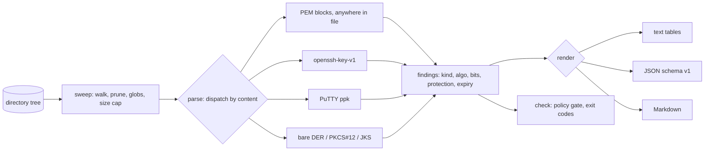

# keysweep

[English](README.md) | [中文](README.zh.md) | [日本語](README.ja.md)

[](LICENSE) [](go.mod) [](CHANGELOG.md)  [](CONTRIBUTING.md)

**keysweep：an open-source, zero-dependency CLI that inventories every private key and certificate on disk — type, bits, protection state, expiry — and turns "how many unprotected keys are on this machine?" into a one-command answer.**


```bash
git clone https://github.com/JaydenCJ/keysweep && cd keysweep
go build -o keysweep ./cmd/keysweep    # single static binary, stdlib only
```

> Pre-release: v0.1.0 is not tagged on a package registry yet; build from source as above (any Go ≥1.22).

## Why keysweep?

Every developer laptop accumulates cryptographic material: SSH keys from three jobs ago, a TLS key copied out of a wiki, a `.p12` from a signing ceremony, an Ed25519 key pasted into a `.env` "temporarily". Nobody knows how many of those private keys are sitting there **without a passphrase**, world-readable, or guarding a certificate that expired last year. Secret scanners don't answer this — gitleaks and trufflehog hunt for API-key *strings* in git history, not key *files* and their protection state. The manual route (`find` + `openssl pkcs8/x509/rsa` per file) requires knowing every encoding in advance and cannot read the formats developers actually use daily: `openssl` won't tell you whether an OpenSSH key is passphrase-protected, and reading a PuTTY `.ppk` header means reaching for PuTTY's own tooling. keysweep detects material by content — PEM anywhere in any file, OpenSSH, PPK, bare DER, PKCS#12, JKS — and reports the four facts that matter for each: what it is, how strong it is, whether a passphrase protects it, and when it dies. A `check` subcommand turns the same sweep into an exit-code gate for release scripts and pre-push hooks. Everything runs offline, decrypts nothing, and never sends a byte anywhere.

| | keysweep | gitleaks / trufflehog | `find` + openssl | cert-expiry monitors |
|---|---|---|---|---|
| Targets key/cert **files**, not API-key strings | ✅ | ❌ strings in git | ✅ | ❌ endpoints |
| Reports passphrase protection state | ✅ incl. cipher | ❌ | partial, per-format flags | ❌ |
| Reads OpenSSH & PuTTY formats | ✅ | ❌ | ❌ | ❌ |
| Finds keys embedded in config files | ✅ with line number | ✅ | ❌ | ❌ |
| Certificate expiry + self-signed + CA flags | ✅ | ❌ | manual per file | ✅ SaaS, network |
| File-permission audit (0644 key = flagged) | ✅ | ❌ | ❌ | ❌ |
| Policy gate with exit codes | ✅ | ✅ | ❌ | ❌ |
| Offline, zero runtime dependencies | ✅ Go stdlib | ❌ deps | ✅ | ❌ SaaS |

<sub>Dependency counts checked 2026-07-12: keysweep imports the Go standard library only; gitleaks v8 pulls ~40 Go modules; trufflehog v3 pulls ~200.</sub>

## Features

- **Content-based detection** — finds PEM blocks anywhere in any file (a key pasted into `.env` is reported as `deploy/.env:5`), plus OpenSSH, PuTTY `.ppk`, bare DER, PKCS#12, and JKS/JCEKS by magic bytes and strict parsing. Extensions are never trusted.
- **Protection state without decryption** — reads the cipher from OpenSSH headers, `DEK-Info` lines, and PBES2 OIDs, so an encrypted key reports `encrypted aes-256-cbc (pbkdf2)` and a naked one reports `plaintext`. keysweep never prompts for or accepts a passphrase.
- **Size even for encrypted keys** — the OpenSSH and PPK formats store the public blob in the clear; keysweep parses the SSH wire format to report `rsa 3072` on a key it cannot (and will not) open.
- **Certificate intelligence** — subject, issuer, expiry with day counts, self-signed and CA flags, for PEM chains and bare DER alike.
- **Permission audit** — any private key readable beyond its owner is flagged with the same `0o077` test OpenSSH uses to refuse identity files.
- **Policy gate for automation** — `keysweep check` exits 1 on plaintext keys, loose permissions, expired or soon-expiring certificates, and sub-floor RSA sizes; each rule can be tuned or disabled by flag.
- **Zero dependencies, fully offline** — Go standard library only; no telemetry, no network, ever. Reports are deterministic: same tree, same bytes.

## Quickstart

```bash
# assemble a demo tree from the repo's committed throwaway fixtures
bash examples/make-demo-dir.sh /tmp/keysweep-demo
./keysweep scan /tmp/keysweep-demo
```

Real captured output:

```text
keysweep scan — /tmp/keysweep-demo
files scanned: 13 · findings: 13

PRIVATE KEYS (7)
  PATH                  ALGO    BITS FORMAT    PROTECTION                     PERMS
  deploy/.env:5         ed25519 256  pkcs8-pem plaintext                      0600
  legacy/ancient.key    dsa     1024 dsa-pem   plaintext                      0644 !
  legacy/server-enc.key ?       -    pkcs8-pem encrypted aes-256-cbc (pbkdf2) 0600
  legacy/server.key     rsa     2048 pkcs1-pem plaintext                      0644 !
  ssh/id_ed25519        ed25519 256  openssh   plaintext                      0600
  ssh/id_rsa            rsa     3072 openssh   encrypted aes256-ctr           0600
  ssh/putty.ppk         rsa     3072 ppk2      encrypted aes256-cbc           0600

CERTIFICATES (3)
  PATH                 SUBJECT              ALGO        BITS NOT AFTER  STATUS
  pki/fullchain.pem    server.example.test  rsa         2048 2036-01-01 ok (3458d)
  pki/fullchain.pem:16 Example Test Root CA ecdsa P-256 256  2036-01-01 ok (3458d)
  pki/old.crt          old.example.test     ed25519     256  2025-01-01 EXPIRED 558d ago

CERTIFICATE REQUESTS (1)
  PATH        SUBJECT          ALGO        BITS
  pki/req.csr req.example.test ecdsa P-256 256

CONTAINERS (2)
  PATH               FORMAT PROTECTION
  store/bundle.p12   pkcs12 password
  store/keystore.jks jks    password

SUMMARY
  private keys : 7 (4 plaintext, 3 encrypted; 2 with loose permissions)
  certificates : 3 (1 expired)
  csr          : 1
  containers   : 2
```

Gate a release on it (`keysweep check --min-rsa-bits 3072`, real output, exit code 1):

```text
BREACH plaintext-key      deploy/.env:5 — private key stored without a passphrase
BREACH plaintext-key      legacy/ancient.key — private key stored without a passphrase
BREACH loose-permissions  legacy/ancient.key — private key readable beyond owner (mode 0644)
BREACH plaintext-key      legacy/server.key — private key stored without a passphrase
BREACH loose-permissions  legacy/server.key — private key readable beyond owner (mode 0644)
BREACH weak-rsa           legacy/server.key — rsa key is 2048 bits, below the 3072-bit floor
BREACH expired            pki/old.crt — certificate "old.example.test" expired 558d ago
BREACH plaintext-key      ssh/id_ed25519 — private key stored without a passphrase
check: 13 files scanned, 13 findings, 8 breaches — FAIL
```

`--format json` emits a stable machine-readable envelope (`schema_version: 1`) for both subcommands.

## What gets detected

Detection is content-based and strict — full rules in [docs/formats.md](docs/formats.md).

| Material | Formats | Recovered without any secret |
|---|---|---|
| Private keys | PKCS#1, PKCS#8 (plain + encrypted), SEC1, DSA, OpenSSH, PPK v1–3, bare DER | algorithm, curve, bits, cipher, KDF |
| Certificates | X.509 PEM (incl. chains) and DER | subject, issuer, validity, key algo/bits, self-signed, CA |
| CSRs | PKCS#10 PEM | subject, key algo/bits |
| Containers | PKCS#12/PFX, JKS, JCEKS | format + password-wrapped status |

## CLI reference

`keysweep [scan|check|version] [flags] [path]` — `scan` is the default. Exit codes: 0 ok, 1 check breach, 2 usage error, 3 runtime error.

| Flag | Default | Effect |
|---|---|---|
| `--format` | `text` | `text`, `json`, or `markdown` (`check`: `text`/`json`) |
| `--exclude` | — | skip paths matching a glob, e.g. `'vendor/**'` (repeatable) |
| `--max-file-size` | `1048576` | skip files larger than N bytes |
| `--all` | off | also scan `.git`, `node_modules`, and other pruned dirs |
| `--jobs` | CPU count | parallel parser workers |
| `--expiring` | `30` (scan) / `0` (check) | flag/fail certificates expiring within N days |
| `--allow-plaintext` (check) | off | do not fail on unencrypted private keys |
| `--ignore-perms` (check) | off | do not fail on group/world-readable key files |
| `--min-rsa-bits` (check) | `0` (off) | fail RSA keys below N bits |

## Verification

This repository ships no CI; every claim above is verified by local runs:

```bash
go test ./...            # 92 deterministic tests, offline, < 5 s
bash scripts/smoke.sh    # end-to-end CLI check, prints SMOKE OK
```

## Architecture



## Roadmap

- [x] v0.1.0 — content-based detection for PEM/OpenSSH/PPK/DER/PKCS#12/JKS, protection + cipher reporting, certificate expiry, permission audit, text/JSON/Markdown reports, `check` policy gate, 92 tests + smoke script
- [ ] Public-key ↔ private-key pairing (spot orphaned halves of a keypair)
- [ ] `--baseline` snapshots to diff inventories over time ("what appeared this month?")
- [ ] Weak-parameter warnings beyond RSA (1024-bit DSA, P-192, `des-cbc` encryption)
- [ ] GPG keyring and age key support
- [ ] Home-directory preset (`keysweep scan --home`) with per-tool hints (`~/.ssh`, `~/.docker`, cloud CLI dirs)

See the [open issues](https://github.com/JaydenCJ/keysweep/issues) for the full list.

## Contributing

Issues, discussions and pull requests are welcome — see [CONTRIBUTING.md](CONTRIBUTING.md) for the local workflow (format, vet, tests, `SMOKE OK`). Good entry points are labelled [good first issue](https://github.com/JaydenCJ/keysweep/issues?q=is%3Aissue+is%3Aopen+label%3A%22good+first+issue%22), and design questions live in [Discussions](https://github.com/JaydenCJ/keysweep/discussions).

## License

[MIT](LICENSE)
