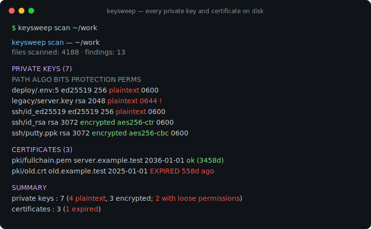
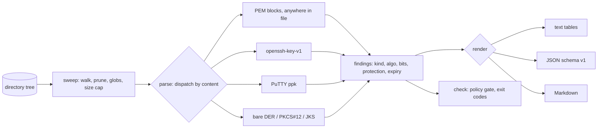

# keysweep

[English](README.md) | [中文](README.zh.md) | [日本語](README.ja.md)

[](LICENSE) [](go.mod) [](CHANGELOG.md)  [](CONTRIBUTING.md)

**keysweep：开源、零依赖的 CLI，盘点磁盘上的每一把私钥和每一张证书——类型、位数、保护状态、有效期——把"这台机器上到底有多少把没加密的私钥？"变成一条命令就能回答的问题。**



```bash
git clone https://github.com/JaydenCJ/keysweep && cd keysweep
go build -o keysweep ./cmd/keysweep    # single static binary, stdlib only
```

> 预发布状态：v0.1.0 尚未发布到任何包仓库；请按上面的方式从源码构建（任意 Go ≥1.22）。

## 为什么选 keysweep？

每台开发机都在悄悄堆积密码学材料：三份工作之前的 SSH 密钥、从 wiki 里拷出来的 TLS 私钥、签名仪式留下的 `.p12`、"临时"粘进 `.env` 的 Ed25519 私钥。没有人知道其中有多少私钥**没有口令保护**、全员可读，或者对应的证书去年就已过期。密钥字符串扫描器回答不了这个问题——gitleaks 和 trufflehog 在 git 历史里找的是 API key *字符串*，不是密钥*文件*及其保护状态。手工路线（`find` + 逐个文件 `openssl pkcs8/x509/rsa`）要求你事先知道每一种编码，而且读不了开发者天天在用的格式：`openssl` 不会告诉你一把 OpenSSH 私钥有没有口令，想读 PuTTY `.ppk` 的头部还得专门搬出 PuTTY 自家的工具。keysweep 按内容识别材料——任意文件中任意位置的 PEM、OpenSSH、PPK、裸 DER、PKCS#12、JKS——并对每一项报告最关键的四个事实：它是什么、有多强、有没有口令保护、什么时候失效。`check` 子命令把同一次扫描变成给发布脚本和 pre-push 钩子用的退出码闸门。一切都离线运行，不解密任何东西，不向任何地方发送任何字节。

| | keysweep | gitleaks / trufflehog | `find` + openssl | 证书到期监控 |
|---|---|---|---|---|
| 面向密钥/证书**文件**而非 API key 字符串 | ✅ | ❌ git 里的字符串 | ✅ | ❌ 只看端点 |
| 报告口令保护状态 | ✅ 含加密算法 | ❌ | 部分，需逐格式加参数 | ❌ |
| 能读 OpenSSH 和 PuTTY 格式 | ✅ | ❌ | ❌ | ❌ |
| 找到嵌在配置文件里的私钥 | ✅ 带行号 | ✅ | ❌ | ❌ |
| 证书有效期 + 自签名 + CA 标记 | ✅ | ❌ | 手工逐个文件 | ✅ SaaS、要联网 |
| 文件权限审计（0644 的私钥会被标记） | ✅ | ❌ | ❌ | ❌ |
| 带退出码的策略闸门 | ✅ | ✅ | ❌ | ❌ |
| 离线、零运行时依赖 | ✅ 仅 Go 标准库 | ❌ 有依赖 | ✅ | ❌ SaaS |

<sub>依赖数量核查于 2026-07-12：keysweep 只 import Go 标准库；gitleaks v8 拉取约 40 个 Go module；trufflehog v3 约 200 个。</sub>

## 功能

- **按内容识别** — 在任意文件的任意位置找出 PEM 块（粘进 `.env` 的私钥会报告为 `deploy/.env:5`），并通过魔数与严格解析识别 OpenSSH、PuTTY `.ppk`、裸 DER、PKCS#12、JKS/JCEKS。永远不信任扩展名。
- **不解密也知道保护状态** — 从 OpenSSH 头部、`DEK-Info` 行、PBES2 OID 读取加密算法：加密的私钥报告 `encrypted aes-256-cbc (pbkdf2)`，裸奔的报告 `plaintext`。keysweep 永远不会索要或接受口令。
- **加密的私钥也能报位数** — OpenSSH 和 PPK 格式的公钥部分是明文存放的；keysweep 解析 SSH wire 格式，对一把它打不开（也不会去打开）的私钥照样报出 `rsa 3072`。
- **证书情报** — 主题、签发者、带天数的有效期、自签名与 CA 标记，PEM 证书链和裸 DER 一视同仁。
- **权限审计** — 任何属主之外可读的私钥都会被标记，判定标准与 OpenSSH 拒绝 identity 文件的 `0o077` 检查完全相同。
- **给自动化用的策略闸门** — `keysweep check` 在遇到明文私钥、宽松权限、已过期或即将过期的证书、低于下限的 RSA 位数时退出码为 1；每条规则都可以用旗标调节或关闭。
- **零依赖、完全离线** — 仅 Go 标准库；没有遥测，永不联网。报告是确定性的：同一棵目录树，输出字节相同。

## 快速上手

```bash
# assemble a demo tree from the repo's committed throwaway fixtures
bash examples/make-demo-dir.sh /tmp/keysweep-demo
./keysweep scan /tmp/keysweep-demo
```

真实捕获的输出：

```text
keysweep scan — /tmp/keysweep-demo
files scanned: 13 · findings: 13

PRIVATE KEYS (7)
  PATH                  ALGO    BITS FORMAT    PROTECTION                     PERMS
  deploy/.env:5         ed25519 256  pkcs8-pem plaintext                      0600
  legacy/ancient.key    dsa     1024 dsa-pem   plaintext                      0644 !
  legacy/server-enc.key ?       -    pkcs8-pem encrypted aes-256-cbc (pbkdf2) 0600
  legacy/server.key     rsa     2048 pkcs1-pem plaintext                      0644 !
  ssh/id_ed25519        ed25519 256  openssh   plaintext                      0600
  ssh/id_rsa            rsa     3072 openssh   encrypted aes256-ctr           0600
  ssh/putty.ppk         rsa     3072 ppk2      encrypted aes256-cbc           0600

CERTIFICATES (3)
  PATH                 SUBJECT              ALGO        BITS NOT AFTER  STATUS
  pki/fullchain.pem    server.example.test  rsa         2048 2036-01-01 ok (3458d)
  pki/fullchain.pem:16 Example Test Root CA ecdsa P-256 256  2036-01-01 ok (3458d)
  pki/old.crt          old.example.test     ed25519     256  2025-01-01 EXPIRED 558d ago

CERTIFICATE REQUESTS (1)
  PATH        SUBJECT          ALGO        BITS
  pki/req.csr req.example.test ecdsa P-256 256

CONTAINERS (2)
  PATH               FORMAT PROTECTION
  store/bundle.p12   pkcs12 password
  store/keystore.jks jks    password

SUMMARY
  private keys : 7 (4 plaintext, 3 encrypted; 2 with loose permissions)
  certificates : 3 (1 expired)
  csr          : 1
  containers   : 2
```

用它给发布把关（`keysweep check --min-rsa-bits 3072`，真实输出，退出码 1）：

```text
BREACH plaintext-key      deploy/.env:5 — private key stored without a passphrase
BREACH plaintext-key      legacy/ancient.key — private key stored without a passphrase
BREACH loose-permissions  legacy/ancient.key — private key readable beyond owner (mode 0644)
BREACH plaintext-key      legacy/server.key — private key stored without a passphrase
BREACH loose-permissions  legacy/server.key — private key readable beyond owner (mode 0644)
BREACH weak-rsa           legacy/server.key — rsa key is 2048 bits, below the 3072-bit floor
BREACH expired            pki/old.crt — certificate "old.example.test" expired 558d ago
BREACH plaintext-key      ssh/id_ed25519 — private key stored without a passphrase
check: 13 files scanned, 13 findings, 8 breaches — FAIL
```

两个子命令都支持 `--format json`，输出稳定的机器可读信封（`schema_version: 1`）。

## 检测范围

检测基于内容且严格校验——完整规则见 [docs/formats.md](docs/formats.md)。

| 材料 | 格式 | 无需任何口令即可获得 |
|---|---|---|
| 私钥 | PKCS#1、PKCS#8（明文 + 加密）、SEC1、DSA、OpenSSH、PPK v1–3、裸 DER | 算法、曲线、位数、加密算法、KDF |
| 证书 | X.509 PEM（含证书链）与 DER | 主题、签发者、有效期、密钥算法/位数、自签名、CA |
| CSR | PKCS#10 PEM | 主题、密钥算法/位数 |
| 容器 | PKCS#12/PFX、JKS、JCEKS | 格式 + 口令包装状态 |

## CLI 参考

`keysweep [scan|check|version] [flags] [path]` — 默认子命令是 `scan`。退出码：0 正常，1 check 触发违规，2 用法错误，3 运行时错误。

| 旗标 | 默认值 | 作用 |
|---|---|---|
| `--format` | `text` | `text`、`json` 或 `markdown`（`check`：`text`/`json`） |
| `--exclude` | — | 跳过匹配 glob 的路径，如 `'vendor/**'`（可重复） |
| `--max-file-size` | `1048576` | 跳过大于 N 字节的文件 |
| `--all` | 关 | 连 `.git`、`node_modules` 等默认剪枝目录也扫描 |
| `--jobs` | CPU 数 | 并行解析 worker 数 |
| `--expiring` | `30`（scan）/ `0`（check） | 标记/判罚 N 天内到期的证书 |
| `--allow-plaintext`（check） | 关 | 不判罚未加密的私钥 |
| `--ignore-perms`（check） | 关 | 不判罚组/全员可读的密钥文件 |
| `--min-rsa-bits`（check） | `0`（关） | 判罚低于 N 位的 RSA 密钥 |

## 验证

本仓库不带 CI；以上每一条主张都由本地运行验证：

```bash
go test ./...            # 92 deterministic tests, offline, < 5 s
bash scripts/smoke.sh    # end-to-end CLI check, prints SMOKE OK
```

## 架构



## 路线图

- [x] v0.1.0 — 基于内容的 PEM/OpenSSH/PPK/DER/PKCS#12/JKS 检测、保护状态与加密算法报告、证书有效期、权限审计、text/JSON/Markdown 报告、`check` 策略闸门、92 个测试 + smoke 脚本
- [ ] 公钥 ↔ 私钥配对（找出密钥对里落单的另一半）
- [ ] `--baseline` 快照，对比不同时间的盘点结果（"这个月新冒出来了什么？"）
- [ ] RSA 之外的弱参数警告（1024 位 DSA、P-192、`des-cbc` 加密）
- [ ] 支持 GPG keyring 与 age 密钥
- [ ] 家目录预设（`keysweep scan --home`），附各工具目录提示（`~/.ssh`、`~/.docker`、云厂商 CLI 目录）

完整列表见 [open issues](https://github.com/JaydenCJ/keysweep/issues)。

## 贡献

欢迎 issue、讨论和 PR——本地工作流（格式化、vet、测试、`SMOKE OK`）见 [CONTRIBUTING.md](CONTRIBUTING.md)。入门任务见 [good first issue](https://github.com/JaydenCJ/keysweep/issues?q=is%3Aissue+is%3Aopen+label%3A%22good+first+issue%22) 标签，设计讨论在 [Discussions](https://github.com/JaydenCJ/keysweep/discussions)。

## 许可证

[MIT](LICENSE)
